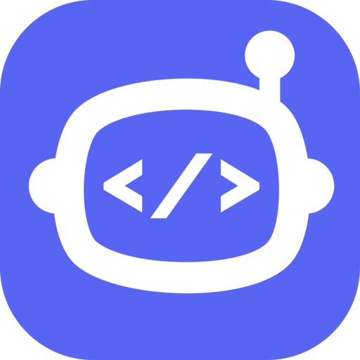

  

# Boot.dev's Take Home Computer Science Projects

This repo contains the complete source code and instructions for all the take-home projects on [Boot.dev's free-to-audit computer science program](https://boot.dev).

* Hit the project with a star if you find it useful ⭐
* Please leave feedback in the form of issues here on Github
* All projects are free to audit, meaning you can read all the material here or on Boot.dev for free

Inside the [projects](projects) folder you'll find the code for each step. However, if you're interested in completing the projects rather than contributing, I recommend using the interface at [Boot.dev](https://boot.dev) rather than sifting through this repo.

## Roadmap

You can find the [roadmap for new projects and courses here](https://github.com/bootdotdev/curriculum), be sure to check it out and let us know what you think.

## 👏 Contribute

We love help and feedback on how we can improve the projects! The recommended way to help is to submit issues here on Github. If you just want to talk about some ideas, use the discussions tab or contact us directly using one of the methods below.

## 💬 Contact

If you would like to discuss the project feel free to [contact us at Boot.dev](https://blog.boot.dev/contact). We're most responsive on Discord, but you can also find us on Twitter.

* [Twitter](https://twitter.com/bootdotdev)
* [Discord](https://discord.gg/EEkFwbv)
